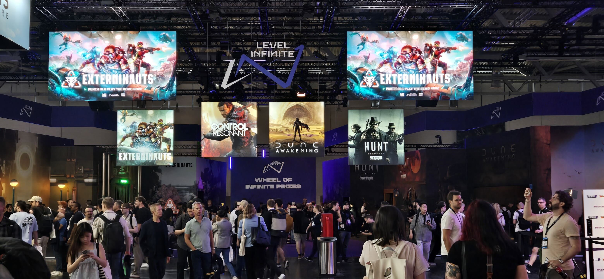
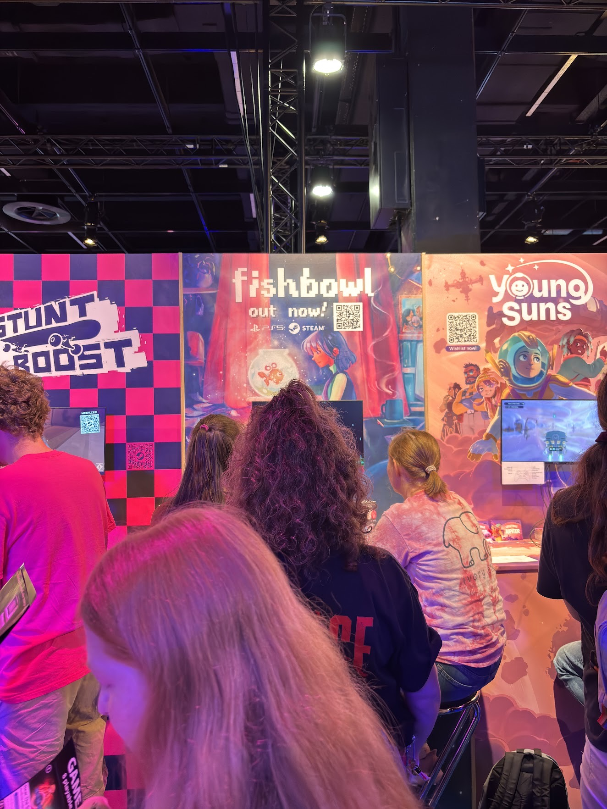
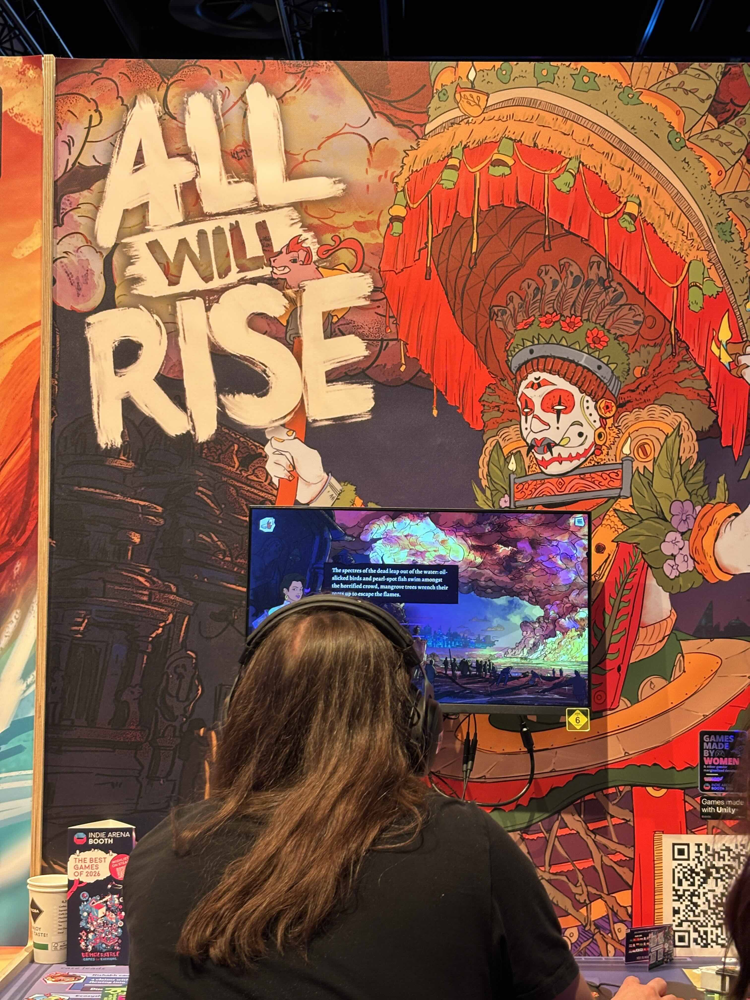
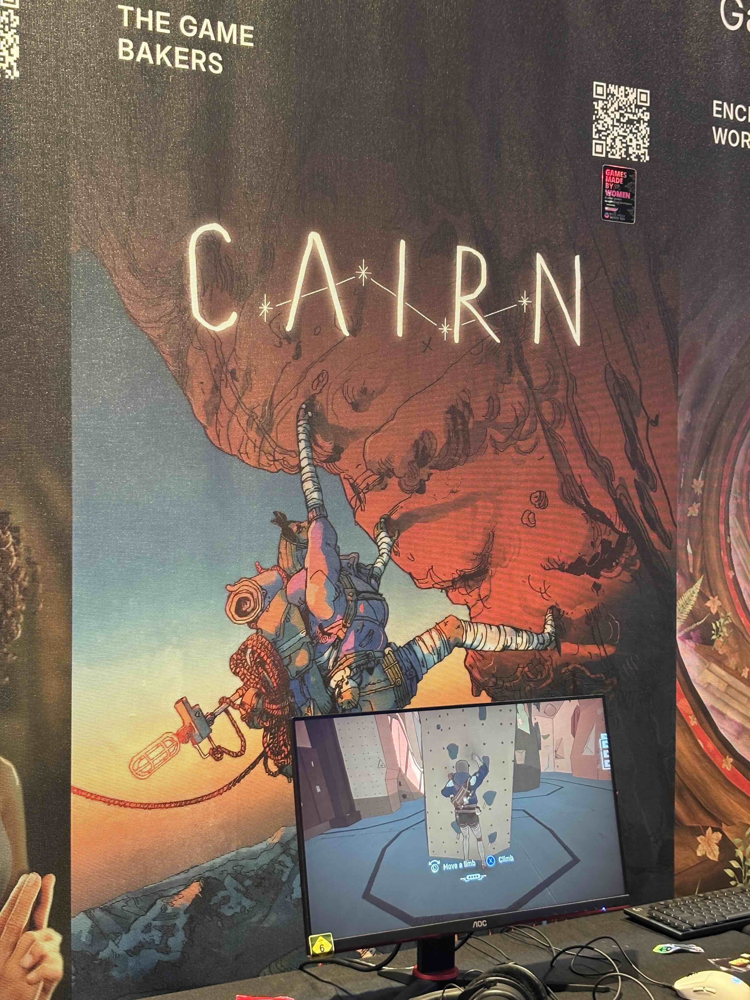

Before we get into this, a very grateful shout out to [Gamedev.In](http://Gamedev.In) without whom I would not have had this opportunity. They partnered with the awesome folks at Gamescom and made this possible. From the Gamescom side, Robin and Adinda, thank you for organizing all of the talks, mixers, orientation, and of course, food! Supercell, you guys are pretty cool for funding this and making it possible. Thank you.

Now, lets get into it.

# What is GamescomDev and Gamescom

Despite working in the industry for a few years now, I had not really heard of Gamescom. Which maybe says more about how American centric my experience of games is because it is the world’s largest computer and gaming convention.

It hosts Gamescom Dev, which is the developer focused two-day event. Here you will find talks, workshops, and 1 on 1 meeting opportunities across every role in the games industry. A developer trying to better understand Unreal? There is a talk for you. A narrative designer looking to break past the conventional quest structure? There is a talk for you. Want to talk to a veteran dev about how to improve your CV or portfolio, they will be here and will likely be willing to help, if not in the moment then later. These are the days when all the developers are present, so even if you don’t find meetings through the app, you will be able to run into people here and strike up a conversation.

Gamescom itself is everything else. Imagine multiple halls the size of Comic Con Mumbai, filled with companies showcasing their games. You have four or so halls booked out by giant AAA booths where they are showcasing their biggest releases.

Then you have a whole hall for indie games, with innumerable Devs from across the world, selected to showcase their unique games. This is where I got to meet up with the lovely folks behind [Fishbowl](https://store.steampowered.com/app/1638070/Fishbowl/), as well as [Raji](https://store.steampowered.com/app/4096880/Raji_Kaliyuga/) and [Appa](https://store.steampowered.com/app/3503500/Appa/). 

And you have multiple booths setup by countries showcasing the talent from their homes. Whether its publishing services, Co-Dev services, or just games that they are proud off. 

There are dedicated areas for independent artists to sell their crafts. From prints, to pins, to plushies. Undoubtedly this is where your wallet is under greatest threat.

So that’s, briefly, [Gamescom and GamescomDev](https://dev.gamescom.global/about-gamescom-dev/). If you’d like, you can read more on their website where they probably do a better job of explaining everything.

# Should you to try to go to it?

Depends.

I know, that is an annoying answer. But you already knew that was what I was going to say. That said, lets break it down.

## Networking

The sheer quality and quantity of industry folks here is wild, which means that if you’re trying to broaden your reach, meet like minded people, connect with other Devs or find a suitable publisher, this is the place to be.

That said, being here does not automatically mean you will make incredible connections. While people are here to network, and they want to find new talent, new games, new developers, new investors, it is hard to stand out. How you go about networking and making these connections will depend on what works for you. There are some great talks on this that I will link here. But a key tip is, do not treat this as a transaction. Instead, be curious and genuine.

Getting back to whether this was good for networking. Well, I did make friends, I met cool Devs from all parts of the world. They have a vast array of experience and many were kind enough to add me to group chats and servers that might benefit me. All in all, I had a good time.

But will this lead to opportunities? That remains to be seen. In some ways, I will only be able to tell if this was fruitful from a networking perspective, in a few months when the conversations I had mature.

## Learning

This depends on your skill level. Are you a newcomer? Okay you’re going to benefit from any talk or workshop you walk into. Are you at an intermediate or experienced level? You will have to pick and choose which talks to go to. Fortunately the programming mentions these tiers in the talk, giving you at least some idea of what level the talk will be shaped at.

I was in talks where senior Devs were listening in and asked deep questions about workflow and specific problems, and there were also talks that took you through some basic concepts, which may be obvious but have not been put into words as succinctly or effectively.

If you’re going, I would spend a good amount of time going through all the planned talks and adding relevant ones to your calendar. You won’t be able to go to all of them. Make a gut call on the day.

Try to go to stuff that actually interests you, not just stuff with big names. Genuine interest will lead to genuine conversation and learning. Both will provide more value than being in the room with a big name that you have nothing to talk to about.

## Cost

This is an expensive endeavor. Every meal, within and without the convention, costs about 6-10 Euros, which is like eating at Starbucks all the time. That said, the food is good (if you’re okay eating meat) and will definitely fill you up. Vegetarian options do exist but I don't know if they are as filling.

Try to eat outside of the convention as meals within cost more. Bring snack bars and water!

As for travel, The flights are cheaper if you book early, but expect 70K minimum (at least that's the pricing I got in 2026).

Shoutout to Skyscanner for finding me cheaper flights that Booking.com. Also, the Flighty app was a lifesaver.

Once at the city, the convention pass grants you access to the busses and trains to and fro from the convention hall. Which means that at least during that week, you can get on any train or bus pretty liberally.

_Note: You should book any other train passes, like ones that you might get for exploring a different city, the moment you know you are going. They are 50-60% cheaper a month out, as opposed to even three weeks out. I landed up paying way more because I didn’t lock plans beyond the convention till much later._

The real cost comes in finding affordable stay. If you can book months in advance, then you can get reasonable stay in Cologne. This will average out to 40 - 50k or so for five nights. Otherwise you are left with a booking in Bonn or Düsseldorf, which are an hour away via train. Even then, the 5-7 days or stay will cost you 50k or so.

The real problem with staying in Düsseldorf or Bonn, is that you need to expend more energy to make it to and from parties and meet ups. Both of which you will want to do if you want to network. Parties usually start at 7pm and go on till midnight. While trains are still running then, getting home at 1:30 - 2am will eat into your sleep as you will need to be back at the conference hall by 9am later that day.

## Ease of Access

Cologne and Germany at large is pretty accesisble if you speak English. Public transport like busses and trains will get you almost everywhere. And most places will have wheelchair access. The talks did not have any sign language interpreters, but I’m not sure if these can be requested. The talks did use slides and are available as videos later so a closed captioning service might do the trick.

_Note, the trains are extremely unreliable and they come at large intervals. So assume that if you miss your train, there will be another 30min wait. While all stations have wheelchair support, if something breaks down late at night, you might be stuck waiting for a long time. Fortunately it is pretty safe._

The actual convention and the scholarship program are very accessible. You do need to be confident and approach people and start conversations, but I found that people were welcoming. Don’t cut lines or interrupt people, that won’t fly. But otherwise, asking for help will get you where you need to be.

## TLDR

So if you're wondering if you should go to Gamescom, I hope this gave you some information to weigh the opportunity out. In brief, it all comes down too, if you can afford it, yes it will provide value. 

**_Below I'm going to break down how this opportunity came to be and the day to day experience!_**

# How it came to be

On 25th June, I came across the post on the [Gamedev.In](http://Gamedev.In) server announcing a chance for 2 devs to go to Gamescom. Even though I’ve worked as a Narrative Designer in the games industry for the last 5 years, I hadn’t actually heard about Gamescom. I knew about GDC, and PAX, and Gen Con, but somehow the biggest gaming convention had escaped my notice.

After [Gamedev.In](http://Gamedev.In)’s announcement, I dug into it and discovered that it was an incredible event that blended developer conference and games convention into one week long extravaganza. I applied because this year I’ve been pushing myself to put myself out there more. This felt like a good opportunity and really, what was the harm in applying?

A few weeks later, I got a call from Vivek from [Gamedev.In](http://Gamedev.In). He told me that I had made the shortlist but they needed to know if I could afford the trip. This had been a criteria on the application form as well so I wasn’t surprised. But as I spoke to Vivek, I wondered if I this was where I wanted to spend my hard earned savings.

I knew that I had the money, but it was a significant chunk of what I had saved up over the years. I countered this with the thought that even if I couldn’t afford to spend these savings, I could find some more resources to enable this opportunity.

I knew of other Devs who had managed to get to GDC through some public funding and though I don’t have the same reach, I estimated that I could ask for some help from the people in my life, especially if this opportunity was worth it. So, despite my concerns, I said yes to Vivek, and awaited the final confirmation.

Once I got that, I was both really happy, and instantly felt like an imposter. Who was I to take up the opportunity, there are far greater Devs out there who could benefit from this. Some of the folks I work with at Tathvamasi Studios would alone be better choices. Honestly, I still feel that way. But I resolved to make the most of the opportunity, even if I didn’t deserve it.

# Day by Day

## Pre-Con Prep

Leading up to the convention, Robin and Adinda had organized many presentations aimed at preparing us for the conference. I recommend attending all of them as they are informational and also a good chance to talk to the other scholars and get to know them. Again, ask people about what they share, share things you are excited by. Your cohort is likely to be your friend group while there, and finding folks you enjoy being around will make the experience better as it can be overwhelming otherwise.

I also browsed [**Eventbrite**](https://www.eventbrite.de/) for any events related to Gamescom. This is where you will find parties, meetups and other hangs that happen after the convention is done for the day. Many are free, but have limited entry. Try get into as many as you can, you can always cancel if you land up with better plans.

I didn’t pay to enter any of these so I can’t say if those pay to enter events were worth it. But there were many that focused on Devs showcasing games or pitching ideas. See what works for you.

I also didn’t sign up for MeetToMatch, this is a paid service that helps people network and connect profiles. This might be worth it if you have a game and are looking for very specific people. But I wanted to largely meet senior Devs and see how I could improve my chances of getting hired as a narrative designer, so I didn’t sign up for this. I also just didn't feel like spending more money in the hopes of networking, it felt too much like paying for LinkedIn. Your mileage may vary.

## Day 1 - Orientation and meeting scholars

This was on Sunday. We arrived midday and were greeted with food and water. As I had just flown 15hrs the day before and then had a late night, this was a welcome treat. There were exercises to help us get to know each other. I engaged with them thoroughly and tried to approach every conversation with curiosity.

There were also micro-talks and some key presentations. All of them were excellent and again gave me the right mindset for the days ahead. Two ideas came up regularly.

1. Don’t try to do everything, you won’t be able to, and will just exhaust yourself
2. Don’t be scared to talk to people and strike up conversation. The worst that can happen is that they say they can’t talk right now. The best that can happen is that you genuinely connect with someone.

After the talks and meals, a bunch of scholars made plans to get some food. A small group of five turned into a large gathering of 20. It was pretty great. (All this because I spoke to people and asked if I could tag along with them.)

## Day 2 - Talks and finding your footing

This was the first real day of GamescomDev. Despite all the advice, I went in too strong and tried to do everything. I also tried to go to the event that everyone was hyped by, instead of the one that I was more curious about. I quickly found myself bored and a little disengaged.

After that first misstep, I course corrected and chose talks that I was excited by, even if there was no hype. I tried to ask a genuine question at the end of every talk because it was a good way to engage the speaker, but also meant I put myself out there and allowed others to notice the kind of things that interest me.

Still, the day was not as fruitful as I would have liked. Despite some good chats, I didn’t really land up exchanging business cards or LinkedIn profiles. Both of which feel awkward but are also the preferred way to stay in touch after the convention. This was because I didn’t ask to add people on LinkedIn or anything. I was too shy to try.

I did land up at the Women in Gaming party that night. This was great, good food, and a lot of cool people. It is free to enter as long as you have a Gamescom pass and register before hand. I recommend going to this one if you can. No you don’t need to be a woman to have access to this.

## Day 3 - Really building connections, choosing between parties and dinners

The day began with a snack share. I brought Kaju Katli with me which was a hit. In retrospect, I should have packed more boxes, I didn’t have enough for the 100 or so scholars there. This was essentially another mixer and a good one at that. Talking about the food people have brought is way easier than trying to pitch games or yourself. It is also another opportunity to make a genuine connection. I spoke to one scholar about where I could find good make-up stores in Germany, and to a curious industry senior about the political landscape of India.

However, special shout out to Steven Taarland of IGDA Foundation. He had given a talk at orientation about putting yourself out there and was present at the snack exchange. He saw me looking a little lost and unsure of myself and called me over. He asked how I was doing and I took the opportunity to tell him that I was feeling like I was fumbling it because even though I was having good conversations, I wasn’t following it up with asking to stay in touch after the fact. He asked me, ‘what’s the harm in trying’ and I agreed that there was no harm. His generosity in that moment really helped center me.

From that point on, I tried to be more confident and approached conversations the way I’ve been saying they should be approached. I was curious, and I always had specific asks at the end of it.

These ranged from, ‘Can I ask you to review my portfolio’ to ‘Hey can I just hit you up on LinkedIn so you can feedback some of my work later?’. What was wild is, no one ever said no. So really, what is the harm in trying? I’d say this shift in mindset made GamescomDev really worthwhile. This was the last day with talks and workshops, so I’m glad I managed to get out of my shell before the general convention began and all these great speakers were lost to the crowd.

The day ended with the Courage Cologne party which is the biggest party that happens at Gamescom. Go to it. I landed up getting a dinner with friends and not being able to get to the party because the trains were super delayed. If the trains hadn’t failed me, I’d have gone to the party. I don’t regret it, I had a blast catching up with friends at Dinner, but its advisable that you prioritize this party in particular.

Oh this is also the day that has Gamescom Opening Night Live. All the games are announced at this event, if you can reserve a seat in time. But its okay if you can’t, you can catch a watch party or just watch it on Youtube later.

## Day 4 - Con floor and having some fun

The convention opens up and you realize that GamescomDev was happening in a place 1/8th the size of the rest of the convention. This place is massive, hopefully the pictures shared above do it justice.

This and the day after are good days to have meetings with people you contacted on the Gamescom app. This way you won’t have to choose between talks and meetings.

On this day, the crowd is still small enough that you can make your way around easily and find everyone you need. There are dedicated halls for GamescomDev folks, you can ask to have all your meetings there, though any other place your contact suggests will be just as viable.

Try to go check out the booths for the games you enjoy. This will be the only time the crowd is small enough that you can get to the front of the line in 30 mins or less. After this day, it will be 1hr+ waits for everything.

I personally recommend spending a lot of time in the Indie area. Play the demos and talk to the Devs. Ask questions. Its a rare chance to meet so many developers working at budgets similar to yours. AAA booths won’t have the primary Devs so you won’t be able to talk to them there. You can request meetings with those Devs but I don’t really know how to set that up. There was a whole floor where CDPR, Xbox, Areanet, etc. had private meeting areas, I still don’t know who meets there. I presume they are talking to various business partners, publishers, and journalists?

## Day 5 - Okay this convention floor is insane, and Final few meetings

This was my last full day at the convention. Thursday. Now the convention was open to everyone which meant that the crowds were insane. If you wanted a chance to demo one of the AAA games, you had to wait an hour or more. If you wanted to collect goodies, you would have the same grind.

I landed up having one or two meetings with people I had contacted over the app, and then I spent time slowly checking out Indies and talking to the Devs. On this day, even playing demos was exhausting as the sheer amount of input was overwhelming. For someone like me, who likes small quiet places, I found it all a bit too much. So pace yourself. Be a fan and have fun.

_Note: The days after this sees all the developers leave and the convention is fully public focused. I didn't stay for this as I was exhausted and wanted to see Berlin before I had to leave. You can stay, some people do, but it is unlikely that this will lead to any work benefit!_

## Takeaways going forwards

Like I said before, whether or not this is a worthwhile experience will vary on a lot of factors. Even I don’t know if this was worth the money it cost. Not yet at least. But I did learn a lot, I made some friends, and I do feel like my horizons have broadened. As India is still a small industry, that exposure to the industry outside is important. I think for local Devs, just learning how and what is done elsewhere is valuable. Otherwise we are at risk of continuing to make the mistakes we already have in our little echo chamber.
