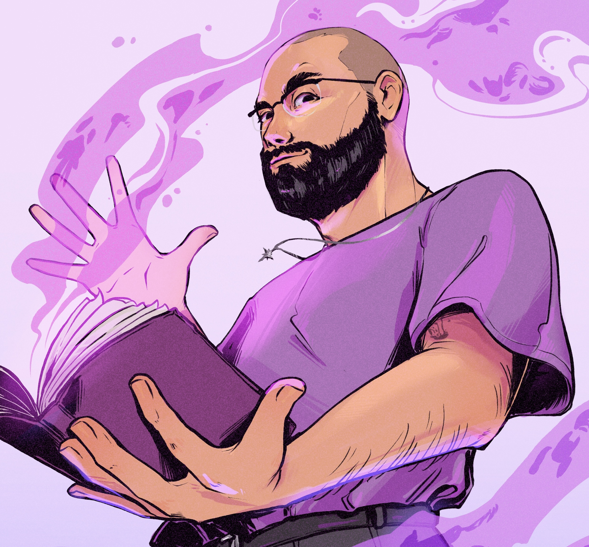

Shubham Mehta is an award-winning screenwriter, narrative designer, world-builder, and teacher from India.

As a Narrative Designer, Shubham worked for Paradox Interactive where he played a central role in researching and designing the content for 'Victoria 3: Pivot of Empire'. He is also the Narrative Designer for Suri: The Seventh Note by Tathvamasi Studios (selected for Sony India Hero Project) where he is developing culturally rooted, universally human stories.

As a screenwriter, he has co-developed films and web series with writers across Bollywood. His short films have won various awards, including the Durban International Film Festival award for Best South African Short Film.

As a world-builder, he has designed unique settings for fantasy table-top roleplaying games, including third party material for Dungeons and Dragons (5e), Pathfinder (2e), and Vampire the Masquerade (5e). Shubham currently serves as the Creative Lead for the Confluence RPG. He is also the co-founder of India’s largest TTRPG community, Desis & Dragons.

Over the last decade, Shubham has honed his understanding of plot and character arcs to apply it to various mediums, beginning in film and arriving at video games. Shubham's work challenges hegemonic views and strikes a balance between being topical and accessible. His writing tackles themes of postcolonial trauma, queer identities in South Asian spaces, and climate change through the lens of Fantasy and Science Fiction.
