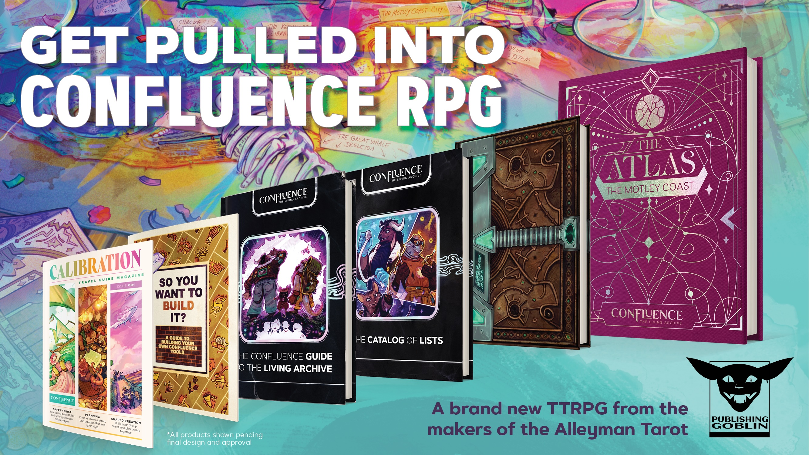

# Creative Lead

Confluence: The Living Archive is a TTRPG by the Publishing Goblin. As the creative lead, I helmed an international team of 15 people (writers, artists, designers) to develop the world for a brand-new RPG. Together, we designed a colorful and diverse world with unique settings, cultures, and people. A great part about this experience was how everyone helped create a stable and joyous work environment focused on meaningful work.
