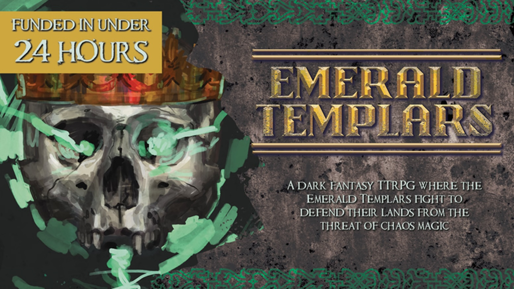

# Worldbuilder

As one of the worldbuilders, I created a unique magical city that was ripe for adventuring. The city of Khalbali is setup to be a melting pot of culture and revolution, inspired by Victorian era theaters, Mumbai's history of mafia funded cinema, and the general oligarchical nature of many governments in modern times. The city blends all these to create a powder keg ready to explode.
