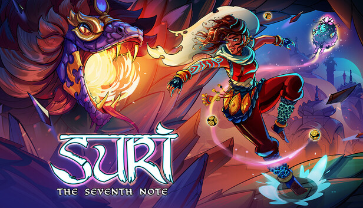
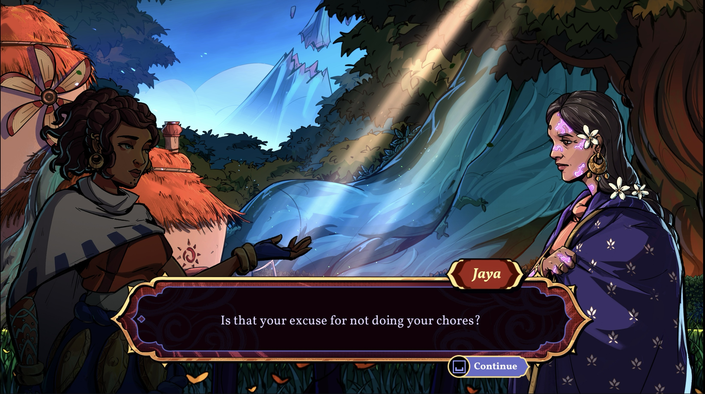
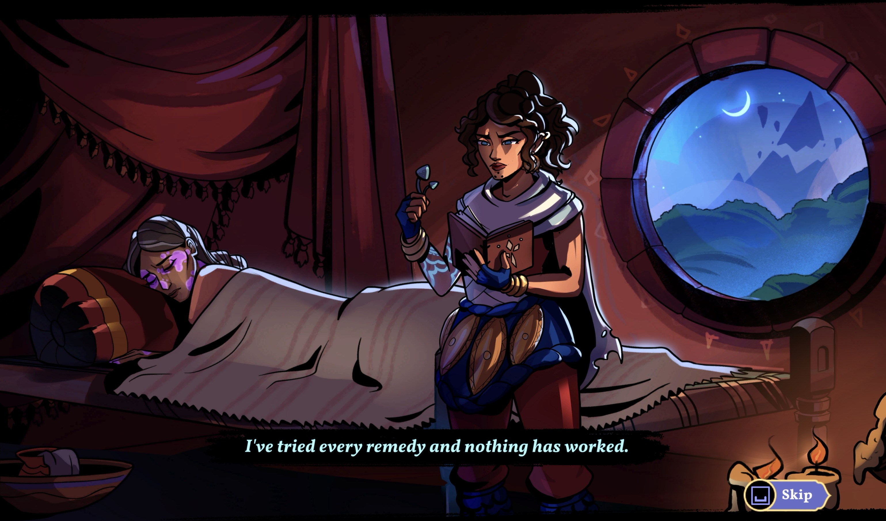
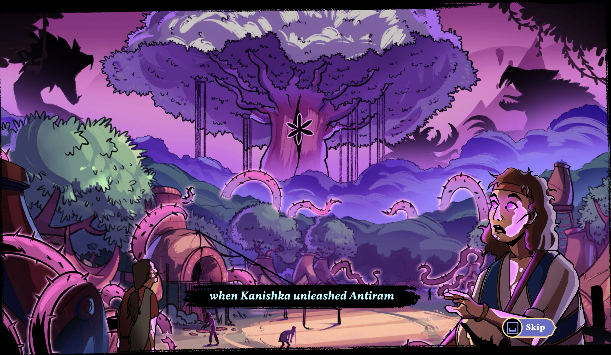

# Narrative Design

Suri: The Seventh Note is set in an original fantasy world where music is magic. As the narrative designer, I worked with the design and art teams to develop a story, character, and world that reflected the rhythm driven gameplay. 

I wrote lore bibles to centralize our understanding of the world. Provided the art team with briefs for the setting and the characters. This helped them develop background assets and characters that felt like thy belonged to the same world. 

I also wrote all the dialogue, inventory entries, and cinematics for the game. Some of which can be seen below!

