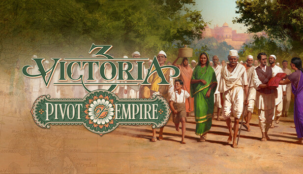
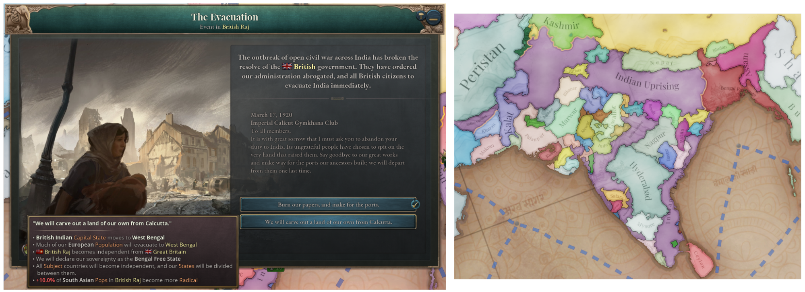
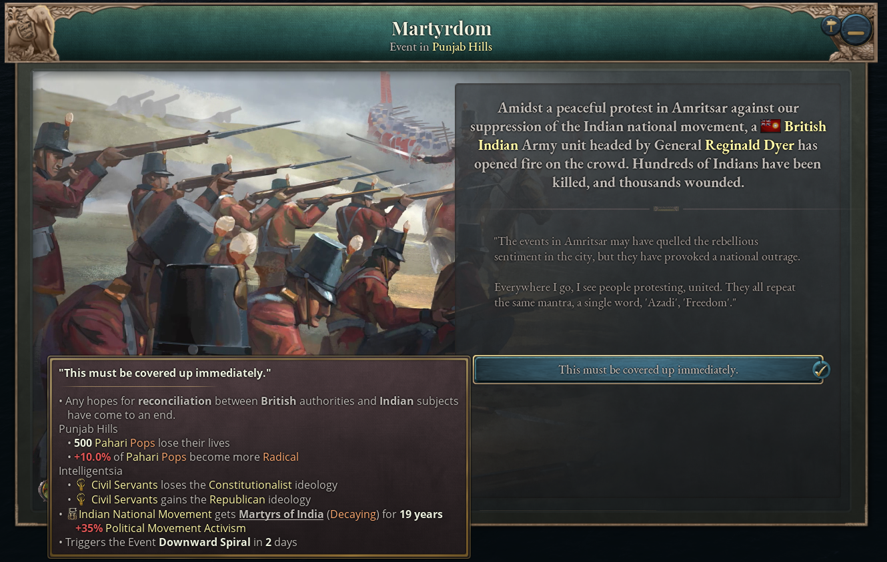
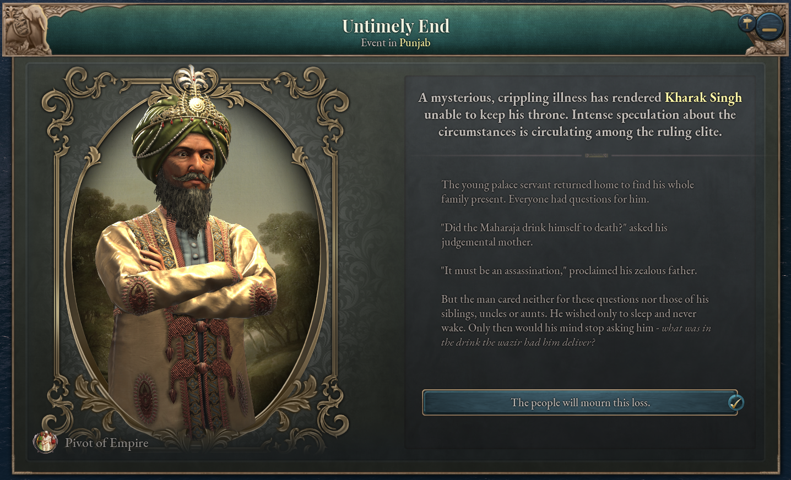

# Game Writer

I played a central role in developing the narrative content for this DLC. The process began with extensive research around the time period. I prepared a database of important individuals, and events, that shaped the 19th and 20th centuries of the Indian sub-continent. 

As I built this database, I also worked on potential Journal Entries that could occur in the game. Journal Entries are the primary narrative element of the game, they provide the player with cultural context and tie the mechanics to the on ground reality of the world they are simulating. Writing these entries involved understanding the mechanics so that the prompts could push and pull on the relevant stats. As well as writing, brief but compelling bits of dialogue that could quickly immerse the player. 

Here are some examples of the entries that the player encounters in the game: 

