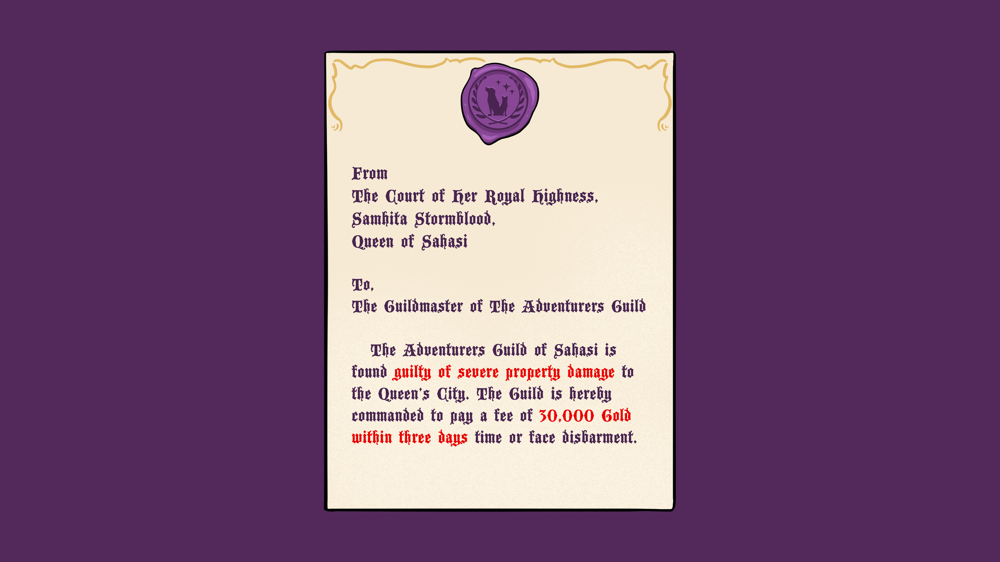
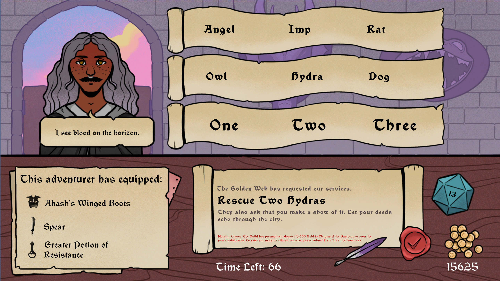
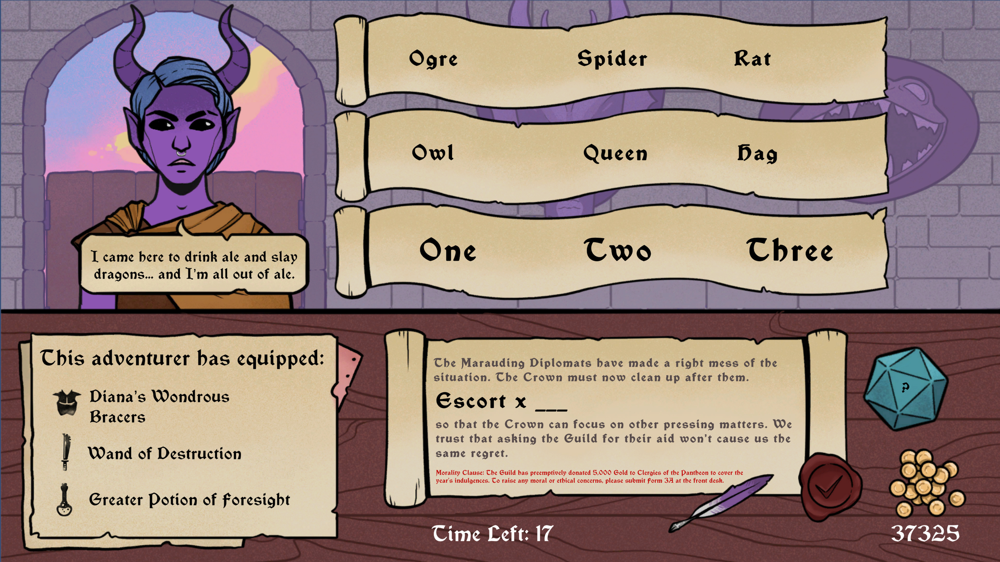

# About the Game

Toe the lines between profit and death in Slay Your Dues, a point-and-click puzzle game where you, the Quest Master, design quests for your Guild's endless adventurers.

# Game Writer

As the writer, I wrote all the in-game text and also helped design the mechanics. The game uses adjectives to give players hints about how 'appropriate' their choices are for each quest. This meant that that all the options the players could choose, had to be carefully written so that they were both, useful and fun. 

I also wrote countless barks for the characters to say as they appeared on the screen. There were different barks based on how well the player was performing. You can see some of the samples below!

