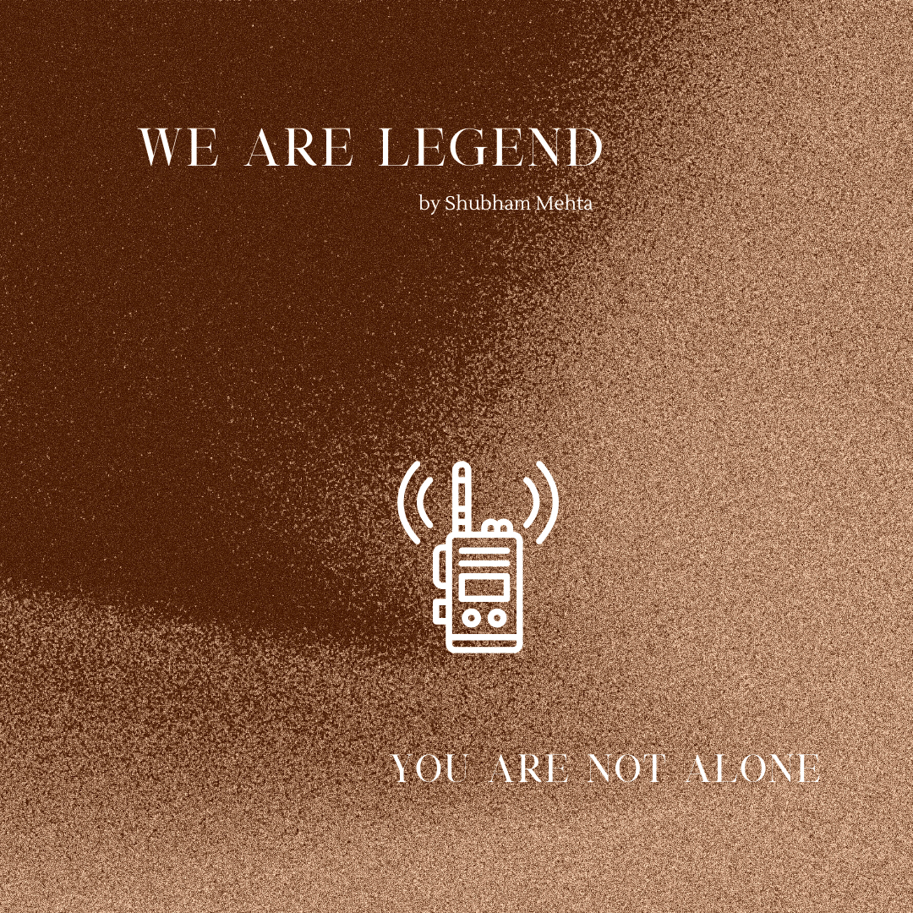

_The world ended two years ago, or maybe it was five? You’ve lost count. After all you were the only survivor so what did it matter?  But all that changed today when someone responded to the radio broadcast you’ve had on loop. You must find each other. Fortunately, both of you can communicate over the radio. Unfortunately, neither of you knows the lay of the land that well. Guide each other closer._

This is a two player game about finding each other at the end of the world. It uses opposed d6 rolls as its core mechanic.

This game was made for the duet game jam hosted by @SolAriaWriting on the Desis & Dragons discord.
